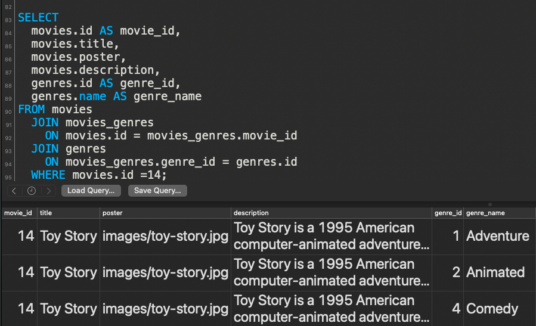

These bits of data illustrate how the data transformation process inside the `GET /api/movies/:id` route.

Each bit of data assumes the following SQL query and SQL query output:




* `joinedData`:

```js
[
  {
    movie_id: 14,
    title: 'Toy Story',
    poster: 'images/toy-story.jpg',
    description: 'Toy Story is a 1995 American computer-animated adventure comedy film produced by Pixar Animation Studios and released by Walt Disney Pictures. The feature-film directorial debut of John Lasseter, it was the first feature-length film to be entirely computer-animated, as well as the first feature film from Pixar. The screenplay was written by Joss Whedon, Andrew Stanton, Joel Cohen, and Alec Sokolow from a story by Lasseter, Stanton, Pete Docter, and Joe Ranft. The film features music by Randy Newman, and was executive-produced by Steve Jobs and Edwin Catmull. The film features the voices of Tom Hanks, Tim Allen, Don Rickles, Wallace Shawn, John Ratzenberger, Jim Varney, Annie Potts, R. Lee Ermey, John Morris, Laurie Metcalf, and Erik von Detten. Taking place in a world where anthropomorphic toys come to life when humans are not present, its plot focuses on the relationship between an old-fashioned pull-string cowboy doll named Woody and an astronaut action figure, Buzz Lightyear, as they evolve from rivals competing for the affections of their owner Andy Davis to friends who work together to be reunited with him after being separated.',
    genre_id: 1,
    genre_name: 'Adventure'
  },
  {
    movie_id: 14,
    title: 'Toy Story',
    poster: 'images/toy-story.jpg',
    description: 'Toy Story is a 1995 American computer-animated adventure comedy film produced by Pixar Animation Studios and released by Walt Disney Pictures. The feature-film directorial debut of John Lasseter, it was the first feature-length film to be entirely computer-animated, as well as the first feature film from Pixar. The screenplay was written by Joss Whedon, Andrew Stanton, Joel Cohen, and Alec Sokolow from a story by Lasseter, Stanton, Pete Docter, and Joe Ranft. The film features music by Randy Newman, and was executive-produced by Steve Jobs and Edwin Catmull. The film features the voices of Tom Hanks, Tim Allen, Don Rickles, Wallace Shawn, John Ratzenberger, Jim Varney, Annie Potts, R. Lee Ermey, John Morris, Laurie Metcalf, and Erik von Detten. Taking place in a world where anthropomorphic toys come to life when humans are not present, its plot focuses on the relationship between an old-fashioned pull-string cowboy doll named Woody and an astronaut action figure, Buzz Lightyear, as they evolve from rivals competing for the affections of their owner Andy Davis to friends who work together to be reunited with him after being separated.',
    genre_id: 2,
    genre_name: 'Animated'
  },
  {
    movie_id: 14,
    title: 'Toy Story',
    poster: 'images/toy-story.jpg',
    description: 'Toy Story is a 1995 American computer-animated adventure comedy film produced by Pixar Animation Studios and released by Walt Disney Pictures. The feature-film directorial debut of John Lasseter, it was the first feature-length film to be entirely computer-animated, as well as the first feature film from Pixar. The screenplay was written by Joss Whedon, Andrew Stanton, Joel Cohen, and Alec Sokolow from a story by Lasseter, Stanton, Pete Docter, and Joe Ranft. The film features music by Randy Newman, and was executive-produced by Steve Jobs and Edwin Catmull. The film features the voices of Tom Hanks, Tim Allen, Don Rickles, Wallace Shawn, John Ratzenberger, Jim Varney, Annie Potts, R. Lee Ermey, John Morris, Laurie Metcalf, and Erik von Detten. Taking place in a world where anthropomorphic toys come to life when humans are not present, its plot focuses on the relationship between an old-fashioned pull-string cowboy doll named Woody and an astronaut action figure, Buzz Lightyear, as they evolve from rivals competing for the affections of their owner Andy Davis to friends who work together to be reunited with him after being separated.',
    genre_id: 4,
    genre_name: 'Comedy'
  }
]
```

---

* `detailsObject` at first:
```js
{
  id: 14,
  title: 'Toy Story',
  poster: 'images/toy-story.jpg',
  description: 'Toy Story is a 1995 American computer-animated adventure comedy film produced by Pixar Animation Studios and released by Walt Disney Pictures. The feature-film directorial debut of John Lasseter, it was the first feature-length film to be entirely computer-animated, as well as the first feature film from Pixar. The screenplay was written by Joss Whedon, Andrew Stanton, Joel Cohen, and Alec Sokolow from a story by Lasseter, Stanton, Pete Docter, and Joe Ranft. The film features music by Randy Newman, and was executive-produced by Steve Jobs and Edwin Catmull. The film features the voices of Tom Hanks, Tim Allen, Don Rickles, Wallace Shawn, John Ratzenberger, Jim Varney, Annie Potts, R. Lee Ermey, John Morris, Laurie Metcalf, and Erik von Detten. Taking place in a world where anthropomorphic toys come to life when humans are not present, its plot focuses on the relationship between an old-fashioned pull-string cowboy doll named Woody and an astronaut action figure, Buzz Lightyear, as they evolve from rivals competing for the affections of their owner Andy Davis to friends who work together to be reunited with him after being separated.'
}
```

---

* `genres`:
```js
[
  { id: 1, name: 'Adventure' },
  { id: 2, name: 'Animated' },
  { id: 4, name: 'Comedy' }
]
```

---

* `detailsObject` after adding the `genres` property:
```js
{
  id: 14,
  title: 'Toy Story',
  poster: 'images/toy-story.jpg',
  description: 'Toy Story is a 1995 American computer-animated adventure comedy film produced by Pixar Animation Studios and released by Walt Disney Pictures. The feature-film directorial debut of John Lasseter, it was the first feature-length film to be entirely computer-animated, as well as the first feature film from Pixar. The screenplay was written by Joss Whedon, Andrew Stanton, Joel Cohen, and Alec Sokolow from a story by Lasseter, Stanton, Pete Docter, and Joe Ranft. The film features music by Randy Newman, and was executive-produced by Steve Jobs and Edwin Catmull. The film features the voices of Tom Hanks, Tim Allen, Don Rickles, Wallace Shawn, John Ratzenberger, Jim Varney, Annie Potts, R. Lee Ermey, John Morris, Laurie Metcalf, and Erik von Detten. Taking place in a world where anthropomorphic toys come to life when humans are not present, its plot focuses on the relationship between an old-fashioned pull-string cowboy doll named Woody and an astronaut action figure, Buzz Lightyear, as they evolve from rivals competing for the affections of their owner Andy Davis to friends who work together to be reunited with him after being separated.',
  genres: [
    { id: 1, name: 'Adventure' },
    { id: 2, name: 'Animated' },
    { id: 4, name: 'Comedy' }
  ]
}
```